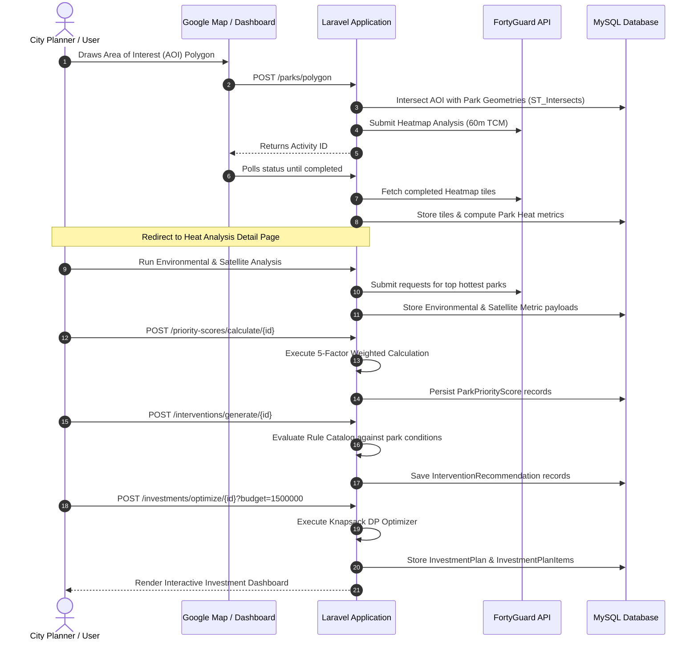

# ParkSense 🌳☀️

> **Intelligent Urban Heat Mitigation Planning System for Phoenix Parks**
> 
> *A data-driven decision-support platform combining satellite thermal analysis, AI land-cover segmentation, multi-criteria priority scoring, and budget-constrained knapsack optimization to protect urban communities from extreme heat.*

## 🎬 Demo

[](https://www.loom.com/share/0175db19449b4d37a1ccee5d8501cd9a)
[](https://parksense-production-n7ta4y.laravel.cloud/)

---

## 🏆 Hackathon Judging Alignment

| Criterion | Weight | How ParkSense Addresses It |
|-----------|--------|----------------------------|
| **Impact** | 40% | Solves real Phoenix heat mortality risk for 189 parks. Output is a ready-to-use investment plan referencing Phoenix's $1.5M Neighborhood Parks Enhancement Program budget |
| **Technical Execution** | 35% | Laravel 11 service architecture, MySQL spatial ST_Intersects queries, async multi-park FortyGuard polling, 5-factor weighted scorer, Knapsack DP budget optimizer |
| **Innovation** | 15% | End-to-end pipeline from thermal map → satellite segmentation → priority score → budget plan. Multi-choice Knapsack optimization for municipal investment allocation |
| **Communication** | 10% | 3-tier evidence framework (🟢🟡🔵), transparent config in `park_heat.php`, 6 specialized READMEs, every number linked to source |

---

## 🔵 FortyGuard API Integration

| FortyGuard API | How ParkSense Uses It |
|---------------|----------------------|
| **Heatmap / TCM** | 60m thermal tiles submitted via polygon AOI → matched to park boundaries → average temp per park |
| **Environmental Parameters** | Heat index, humidity, wet bulb, solar GHI per park → feeds Environmental Stress score (20% weight) |
| **Satellite Segmentation** | AI land-cover analysis → tree %, hard surface %, bare ground % → feeds Physical Condition (15%) + Opportunity (10%) scores |
| **Status Polling `/status/{id}`** | Async polling for all 3 parks in parallel using `Set`-based activity ID tracking — resolves only when all parks complete |

---

## ⚠️ Important Notes for Evaluators & Local Development

Please be aware of the following when testing or running this application locally:

1. **Google Maps API Key**: For local development, a valid Google Maps API Key is **required** for map and polygon-drawing functionality.
2. **Live FortyGuard API Usage & Retries**: This application queries live FortyGuard APIs. Occasionally, API requests may require a manual retry if the external server takes too long to respond.
3. **Incomplete Environmental Results**: The Environmental Parameters API polling can take a while to return a completed status. Sometimes it may return incomplete results (e.g., retrieving data for only 2 out of 3 parks) because the external API might drop or fail to process small or complex park geometries. **If this happens, refresh the page and select the park polygon again.**
4. **Satellite Processing Time**: The Satellite AI Segmentation API works correctly but takes a little longer to process images. **Please be patient**—this latency is from the external FortyGuard API's processing side, not our application's end.
5. **Top N Parks Analysis Limit**: By default, the application is configured to select the **top 3 hottest parks** (based on the heatmap record) for environmental and satellite analysis to avoid hitting API rate limits. If you need to analyze more parks at once, you can edit the `3` limit in these two controller files:
   - `app/Http/Controllers/EnvironmentalAnalysisController.php`
   - `app/Http/Controllers/SatelliteAnalysisController.php`
6. **Flatland Parks Scope**: The dataset is strictly scoped to the **flatland municipal parks of the City of Phoenix** (189 parks in total). Mountain preserves, desert parks, and open space parks (e.g., Camelback Mountain, South Mountain Park) are intentionally excluded from the data model, aligning with standard municipal shade/cooling intervention programs where structural interventions (e.g., Ramadas, cool pavements) are feasible.

---

## 📋 Table of Contents

1. [Project Overview](#-project-overview)
2. [The Problem](#-the-problem)
3. [The Solution](#-the-solution)
4. [Architecture & Technology Stack](#-architecture--technology-stack)
5. [Key Features & Analysis Pipeline](#-key-features--analysis-pipeline)
6. [Data Sources & Evidence Framework](#-data-sources--evidence-framework)
7. [System Workflow](#-system-workflow)
8. [Project Structure](#-project-structure)
9. [Configuration Reference](#-configuration-reference)
10. [Local Development Setup](#-local-development-setup)
11. [Testing & Verification](#-testing--validation)
12. [Specialized Documentation Links](#-specialized-documentation-links)
13. [License & Attributions](#-license--attributions)

---

## 📍 Project Overview

**ParkSense** is a full-stack urban heat intelligence application designed for city planners, municipal sustainability officers, and park managers in the City of Phoenix. By integrating high-resolution thermal data, satellite land-cover segmentation, and Phoenix municipal standards, ParkSense translates raw geospatial metrics into actionable, cost-modeled cooling interventions.

### Target Users
- **Urban Planners & Municipal Officials**: Design data-backed shade and cooling master plans.
- **Parks & Recreation Managers**: Identify vulnerable parks and prioritize capital improvement projects.
- **Heat Mitigation Specialists & Researchers**: Model thermal stress patterns and assess return on investment for cooling strategies.

---

## 🌵 The Problem

Phoenix, Arizona experiences some of the most extreme summer temperatures in North America, with summer highs consistently exceeding 110°F (43.3°C). Dense impervious surfaces exacerbate the Urban Heat Island (UHI) effect, retaining ambient heat overnight and creating severe public health hazards.

### Planning Challenges
1. **Disparate Data Silos**: Temperature data, satellite land-cover imagery, and park amenity inventories are rarely integrated into a single actionable interface.
2. **Subjective Prioritization**: Without objective multi-criteria scoring, resource allocation can be arbitrary rather than heat-risk-driven.
3. **Uncertain Cost-Benefit Ratios**: Municipal decision-makers lack transparent, evidence-based cost models to justify funding for trees, shade structures, or reflective coatings within strict budgetary constraints.

---

## 💡 The Solution

ParkSense solves these challenges through an end-to-end analytical pipeline:

1. **Interactive Spatial Targeting**: Draw arbitrary Areas of Interest (AOI) across Phoenix to dynamically intersect flatland municipal parks.
2. **Thermal Snapshot Ingestion**: Query FortyGuard's 60m-resolution thermal models to establish park-level temperature baselines.
3. **AI-Driven Land Cover & Environmental Profiling**: Retrieve multi-spectral satellite segmentation and microclimate stress metrics (heat index, wet bulb, solar irradiance).
4. **5-Factor Weighted Priority Scoring**: Calculate composite urgency scores (0–100) reflecting heat severity, environmental stress, physical deficits, civic importance, and intervention feasibility.
5. **Rule-Based Cooling Recommendations**: Trigger Phoenix-verified intervention packages (Tree Planting, Ramadas, Cool Pavement) tailored to each park's physical footprint.
6. **Budget Optimization Engine**: Execute a Multiple-Choice Knapsack Algorithm to maximize community cooling benefit while strictly adhering to municipal budget limits.

---

## 🌍 Global Potential: Real-World Impact in South Asia

While modeled using Phoenix datasets as a primary baseline, ParkSense is designed for universal geographic adaptability. It has immense potential in the Global South, particularly in South Asia (e.g., India, Pakistan, Bangladesh):

* **Extreme Climate Vulnerability**: South Asian urban centers frequently face prolonged heatwaves with wet-bulb temperatures reaching dangerous thresholds (exceeding 45°C - 50°C), resulting in severe health crises for dense populations.
* **Tight Budget Scarcity**: Unlike wealthy western municipalities, cities in South Asia work with extremely constrained budgets. The **Knapsack Budget Optimization Engine** represents the true value of this project: it mathematically calculates how to achieve the absolute maximum cooling benefit (e.g., opting for cost-effective native trees like Neem or Banyan versus expensive structures) within tight, realistic budget boundaries.
* **Socioeconomic Prioritization**: By modifying the scoring weight configurations, cities can incorporate high-density slum data and local socio-economic demographics into the priority scorer, routing cooling resources directly to communities that lack indoor air conditioning—saving lives where it matters most.

---

## 🏗️ Architecture & Technology Stack

ParkSense is built with a modern, reactive single-page architecture utilizing Laravel 11 and Inertia.js with Vue 3.

```
┌─────────────────────────────────────────────────────────────────┐
│                       Frontend Layer                            │
│    Vue 3 (Composition API) + TypeScript + Tailwind CSS v4       │
│    Shadcn/UI Components + Google Maps JavaScript API (Loader)   │
└─────────────────────────────────┬───────────────────────────────┘
                                  │ Inertia.js Bridge
┌─────────────────────────────────▼───────────────────────────────┐
│                       Backend Layer (PHP 8.2+)                  │
│    Laravel 11 Application Framework + Service-Calculator Pattern│
│    Eloquent Spatial (MySQL Spatial ST_Intersects / Geometry)    │
└──────────────┬──────────────────────────────────┬───────────────┘
               │                                  │
┌──────────────▼──────────────┐    ┌──────────────▼───────────────┐
│      External APIs          │    │       Database Layer         │
│  - FortyGuard Heatmap API   │    │  - MySQL 8.0+ / Spatial GIS  │
│  - FortyGuard Satellite API │    │  - Spatial Geometry Indexing │
│  - FortyGuard Env API       │    │  - Full Relational Cascade   │
│  - Google Maps Maps/Drawing │    └──────────────────────────────┘
└─────────────────────────────┘
```

### Core Technologies
- **Backend Framework**: [Laravel 11](https://laravel.com/) with dedicated Action classes and Domain Services.
- **Frontend Framework**: [Vue 3](https://vuejs.org/) (Script Setup, Composition API, TypeScript).
- **SPA Bridge**: [Inertia.js v2](https://inertiajs.com/) for fluid client-side routing without API boilerplate.
- **Styling**: [Tailwind CSS v4](https://tailwindcss.com/) with curated shadcn-vue primitives.
- **Spatial Engine**: `matanyadaev/laravel-eloquent-spatial` for native MySQL OpenGIS operations.
- **External Integration**: Dedicated FortyGuard Client with retry handlers and asynchronous polling composables.

---

## 🔍 Key Features & Analysis Pipeline

| Feature | Description | Technical Component | Documentation |
| :--- | :--- | :--- | :--- |
| **Park Spatial Boundary Ingestion** | 189 flatland Phoenix parks stored as native polygon geometries. | `Park` Model, `matanyadaev/laravel-eloquent-spatial` | [Parks Data](README_PARKS_DATA.md) |
| **Heat Analysis & AOI Mapping** | Polygon drawing on Google Maps, AOI spatial intersection, and 60m TCM thermal tile aggregation. | `SendFortyGuardHeatmapRequest`, `ParkHeatAnalysisService` | [Heat Analysis](README_HEAT_ANALYSIS.md) |
| **Environmental & Satellite Profiling** | Asynchronous retrieval of heat index, humidity, solar GHI, and AI satellite land-cover segmentation. | `EnvironmentalAnalysisService`, `SatelliteAnalysisService` | [Env & Sat Analysis](README_ENV_SAT_ANALYSIS.md) |
| **5-Factor Priority Scoring** | Normalization of multi-sensor data into composite urgency scores (0–100). | `ParkPriorityScoreService`, Domain Calculators | [Priority Scoring](README_PRIORITY_SCORING.md) |
| **Cooling Recommendations** | Rule-based selection of tree packages, shade ramadas, and cool pavements with Phoenix-verified costs. | `InterventionSelectionService`, `CoolingBenefitHelper` | [Cooling Solutions](README_COOLING_SOLUTIONS.md) |
| **Knapsack Budget Optimization** | Dynamic programming algorithm solving the multi-choice knapsack problem under fixed budget caps. | `BudgetOptimizerService`, `InvestmentController` | [Budget Optimization](README_BUDGET_OPTIMIZATION.md) |

---

## 📊 Data Sources & Evidence Framework

ParkSense maintains strict transparency by classifying all figures into three distinct evidence tiers:

```
┌─────────────────────────────────────────────────────────────────────────────┐
│ 🟢 Level 1: Phoenix Verified                                                │
│ Official municipal reports, voter-approved bonds, and City of Phoenix plans.│
│ Examples: $1,050 tree upfront cost, $40k–$80k ramadas, $1.5M NPEP reference │
├─────────────────────────────────────────────────────────────────────────────┤
│ 🟡 Level 2: Planning Assumptions                                            │
│ Transparent engineering and modeling parameters for scenario optimization.  │
│ Examples: 10% hard surface cool pavement, tree package sizes (25/50/100)    │
├─────────────────────────────────────────────────────────────────────────────┤
│ 🔵 Level 3: FortyGuard Measured Data                                        │
│ High-resolution empirical sensor readings and multi-spectral AI segmentations│
│ Examples: 60m thermal tiles, land-cover percentages, GHI solar irradiance   │
└─────────────────────────────────────────────────────────────────────────────┘
```

### Primary Reference Documents
1. **City of Phoenix Shade Phoenix Plan**: Verified tree purchase ($750), labor, irrigation ($300), and water maintenance calculations. ([PDF Link](https://www.phoenix.gov/content/dam/phoenix/heatsite/documents/BP_ShadePhoenixPlan_Report_031025_EN.pdf))
2. **City of Phoenix Neighborhood Parks Enhancement Program (NPEP)**: Verified ramada cost ranges and standard $1.5M program funding reference. ([Link](https://www.phoenix.gov/administration/departments/parks/about-us/improvement-projects/neighborhood-parks-enhancement-program.html))
3. **ASU / City of Phoenix Cool Pavement Study**: Surface temperature reduction measurements on treated pavements.
4. **NWS Phoenix Climate Records & NOAA**: Summer climate baseline thresholds (30°C–45°C normalization).

---

## 🔄 System Workflow



---

## 📁 Project Structure

```
parksense/
├── app/
│   ├── Actions/        # Single-purpose action classes (Heatmap requests & management)
│   ├── Http/           # HTTP controllers (Analysis triggers, priority scoring, budget optimization)
│   ├── Models/         # Eloquent Models & spatial GIS geometry casts
│   └── Services/       # Core domain services (Knapsack Budget Optimizer, Priority Scoring, FortyGuard Client)
├── config/             # Weights, temperature thresholds, and cooling benefit evidence maps
├── database/           # Schema migrations & Phoenix GeoJSON park GIS boundary seeders
├── resources/js/       # SPA application layer (Vue 3, Shadcn-Vue, Google Maps API)
│   ├── components/     # Reusable dashboard widgets, layout containers, and drawing map components
│   ├── composables/    # State management hooks for asynchronous FortyGuard API polling
│   └── pages/          # Primary SPA pages (Dashboard project list and analysis detail cockpit)
└── routes/web.php      # Application routes and web endpoints
```

---

## ⚙️ Configuration Reference

### `config/park_heat.php`
Centralizes all numerical weights, climate thresholds, and intervention catalogs:
- **`priority_weights`**:
  - `heat_severity`: `0.40` (40%)
  - `environmental_stress`: `0.20` (20%)
  - `physical_condition`: `0.15` (15%)
  - `park_importance`: `0.15` (15%)
  - `intervention_opportunity`: `0.10` (10%)
- **`temperature_thresholds`**: `min: 30°C`, `max: 45°C` (Phoenix summer range).
- **`interventions.catalog`**: Phoenix-verified unit costs for `tree_planting`, `ramada`, and `cool_pavement`.

---

## 💻 Local Development Setup

### Prerequisites
- **PHP**: 8.2 or higher
- **Composer**: 2.x
- **Node.js**: 20.x or higher (with npm or pnpm)
- **MySQL**: 8.0+ (required for native spatial geometry support)

### Installation Steps

1. **Clone the repository**:
   ```bash
   git clone https://github.com/hamza094/parksense.git
   cd parksense
   ```

2. **Install PHP and Node dependencies**:
   ```bash
   composer install
   npm install
   ```

3. **Configure Environment File**:
   ```bash
   cp .env.example .env
   php artisan key:generate
   ```

4. **Set Environment Variables in `.env`**:
   ```env
   APP_NAME=ParkSense
   APP_URL=http://parksense.test

   DB_CONNECTION=mysql
   DB_HOST=127.0.0.1
   DB_PORT=3306
   DB_DATABASE=parksense
   DB_USERNAME=root
   DB_PASSWORD=

   # External API Keys
   VITE_GOOGLE_MAPS_API_KEY=your_google_maps_api_key_here
   FORTYGUARD_API_KEY=your_fortyguard_api_key_here
   FORTYGUARD_BASE_URL=https://api.fortyguard.com
   ```

5. **Run Migrations & Seed Phoenix Parks**:
   ```bash
   php artisan migrate --seed
   ```

6. **Start Local Development Servers**:
   ```bash
   # Run Vite and Laravel concurrently
   npm run dev
   php artisan serve
   ```

---

## 🧪 Testing & Validation

Execute automated tests and validation scripts:

```bash
# Run PHPUnit / Pest tests
php artisan test

# Check TypeScript typing
npm run types:check

# Validate environmental metric distributions
php analyze_environmental_metrics.php

# Validate satellite metric segmentation
php analyze_satellite_metrics.php
```

---

## 📚 Specialized Documentation Links

For in-depth mathematical formulas, municipal citations, and technical deep-dives:

- [📍 Phoenix Parks Foundation Data](README_PARKS_DATA.md) — Boundary definitions, GIS attributes, and flatland park filtering rationale.
- [🗺️ Heat Analysis & Thermal Mapping](README_HEAT_ANALYSIS.md) — 60m TCM parameters, tile-park matching, and bounding box algorithms.
- [🌡️ Environmental & Satellite Profiling](README_ENV_SAT_ANALYSIS.md) — Microclimate stress metrics and AI satellite segmentation.
- [🎯 5-Factor Priority Scoring Model](README_PRIORITY_SCORING.md) — Full mathematical normalization equations and factor breakdown.
- [🛠️ Cooling Solutions & Catalog](README_COOLING_SOLUTIONS.md) — Phoenix Shade Plan costs, rule triggers, and research citations.
- [💰 Knapsack Budget Optimization](README_BUDGET_OPTIMIZATION.md) — Dynamic programming logic, scale factors, and $1.5M NPEP scenarios.

---

## 📜 License & Attributions

- **License**: Proprietary / Educational Research Project.
- **Municipal Data**: City of Phoenix Open GIS Data & Street Transportation / Parks and Recreation Departments.
- **Thermal & Segmentation Models**: Powered by [FortyGuard](https://fortyguard.com/) Urban Thermal APIs.
- **Mapping**: Google Maps JavaScript API.
